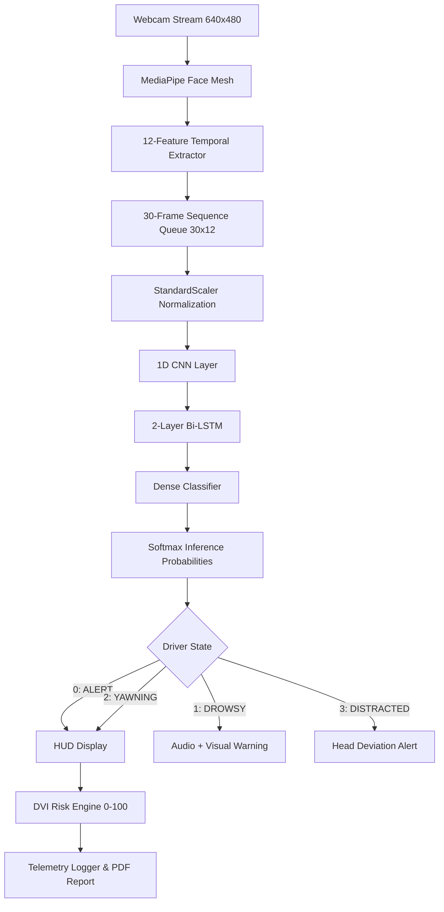

# Driver Safety AI 🚗🛡️

**Real-Time Driver Drowsiness and Vigilance Detection Using MediaPipe, 1D-CNN and Bi-LSTM**

**Author**: Manoj Kumar C  
**Degree**: B.Tech Computer Science and Engineering  
**Institution**: Academic Deep Learning & Computer Vision Project  

---

## 🌟 Project Overview
**Driver Safety AI** is a real-time computer vision and deep learning system engineered to monitor driver fatigue, micro-sleep, yawning, and distraction using a standard webcam. 

Unlike simple static threshold systems, Driver Safety AI employs a temporal architecture:
1. **MediaPipe Facial Landmark Engine**: Extracts 468 3D facial landmarks on CPU.
2. **Temporal Feature Extractor**: Computes 12 frame-level and rolling temporal metrics (EAR, MAR, Head Pose, PERCLOS, Blink Rate, Durations, Motion).
3. **Sliding Window Sequence Queue**: Assembles 30 consecutive temporal frames $(30 \times 12)$.
4. **Hybrid Deep Learning Model**: Combines a **1D CNN** for temporal feature representation with a **2-Layer Bidirectional LSTM** for long-range sequence classification.
5. **Temporal Safety State Manager**: Resolves noisy ML predictions into a stable 5-stage state machine (`ALERT`, `SUSPECTED`, `CONFIRMED`, `PERSISTENT`, `RECOVERING`) using real-world timing hysteresis, response monitoring, and blink protection ($\le 0.35$s).
6. **Multi-Stage Voice Intervention Engine**: Provides graded, non-blocking voice audio warnings (Levels 1 to 3) using a 100% reliable native Windows SAPI COM implementation (`SAPI.SpVoice`).
7. **Real-time HUD & DVI Engine**: Computes a Driver Vigilance Index (DVI), presents Softmax probability bars, EAR sparkline graph, optional 3D head coordinate axes, and triggers a strong red strobe flash effect on critical drowsiness.

---

## 🏗️ Architecture Pipeline



---

## 📊 Target Classes
1. `ALERT` (0): Normal attentive driving posture and eye state.
2. `DROWSY` (1): Prolonged eye closure, micro-sleep, high PERCLOS score.
3. `YAWNING` (2): Extended mouth opening dynamics.
4. `DISTRACTED` (3): Sustained head deviation away from forward driving direction (Yaw > 25° / Pitch > 20°).

---

## 🛠️ Installation & Setup

### 1. Create Virtual Environment
```cmd
python -m venv .venv
.venv\Scripts\activate
```

### 2. Install Dependencies
```cmd
pip install -r requirements.txt
```

---

## 🚀 Usage Commands

### 1. Run Real-Time Webcam Monitoring Application
```cmd
python main.py
```

### 2. Collect Live Driver Telemetry Feature Data
```cmd
# Record ALERT driving telemetry
python src/data/collect_data.py --label ALERT --subject_id subject_01

# Record DROWSY driver telemetry
python src/data/collect_data.py --label DROWSY --subject_id subject_01

# Record YAWNING driver telemetry
python src/data/collect_data.py --label YAWNING --subject_id subject_01

# Record DISTRACTED driver telemetry
python src/data/collect_data.py --label DISTRACTED --subject_id subject_01
```

### 3. Train Model
```cmd
python -m src.training.train
```

### 4. Evaluate Model on Test Set
```cmd
python -m src.training.evaluate
```

### 5. Run Automated Unit & Integration Tests
```cmd
pytest
```

---

## 🎮 Keyboard Controls in Real-Time App

| Key | Action |
|---|---|
| `q` | Quit application and generate session summary CSV/JSON |
| `m` | Toggle MediaPipe Face Mesh overlay |
| `a` | Toggle 3D Head Coordinate Axes ($X$=Red, $Y$=Green, $Z$=Blue) |
| `g` | Toggle Rolling EAR Oscilloscope Sparkline Graph |
| `p` | Toggle Softmax Class Probability Bars |

---

## 📈 Driver Vigilance Index (DVI)
The **Driver Vigilance Index (DVI)** is a project-defined 0–100 normalized risk score:
$$\text{DVI} = 100 \times \left(0.40 \times (1 - P_{\text{ALERT}}) + 0.30 \times \text{PERCLOS} + 0.20 \times \text{NormEyeClosure} + 0.10 \times \text{NormYawDev}\right)$$

### Risk Levels:
- **0 – 25**: `LOW` Risk (Green)
- **25 – 50**: `MODERATE` Risk (Yellow)
- **50 – 75**: `HIGH` Risk (Orange)
- **75 – 100**: `CRITICAL` Risk (Red - Triggers Audio Alarm)

---

## ⚠️ Academic & Safety Disclaimer
> **IMPORTANT DISCLAIMER**: This project is an academic prototype designed for university coursework and research demonstration. It is NOT a certified automotive safety device and must not be relied upon as the sole mechanism for preventing driver fatigue or motor vehicle collisions. The Driver Vigilance Index (DVI) is a project-defined score and not a medically or automotive-certified metric.
