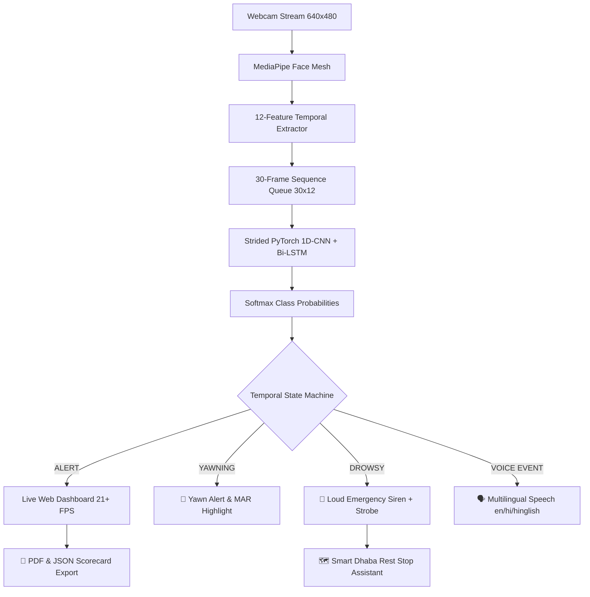

# Driver Safety AI 🚗🛡️

**Real-Time Driver Drowsiness, Yawning & Fatigue Monitoring Cockpit Using MediaPipe, 1D-CNN + Bi-LSTM Deep Learning & Web Telemetry**

**Author**: Manoj Kumar C  
**Degree**: B.Tech Computer Science and Engineering  
**Institution**: Academic Deep Learning & Computer Vision Project  

---

## 🌟 Project Overview
**Driver Safety AI** is a state-of-the-art computer vision and temporal deep learning platform engineered to monitor driver fatigue, micro-sleep, yawning, and head distraction in real-time using standard webcams. 

Unlike conventional static threshold detectors, Driver Safety AI combines:
1. **MediaPipe Facial Landmark Engine**: Tracks 468 3D facial landmarks on CPU without requiring expensive GPUs.
2. **Temporal Feature Extractor**: Computes 12 frame-level and rolling temporal metrics (EAR, MAR, PERCLOS, Blink Rate, Durations, Head Yaw & Pitch).
3. **Sliding Window Sequence Queue**: Maintains a 30-frame sequence buffer $(30 \times 12)$.
4. **Hybrid 1D-CNN + Bi-LSTM Model**: Uses 1D Convolutional layers for spatio-temporal feature extraction combined with a 2-layer Bidirectional LSTM for sequence classification.
5. **Strided Inference Engine**: Runs PyTorch neural network inference every 4 frames with probability caching to achieve **21+ FPS** zero-latency streaming.
6. **Temporal Safety State Machine**: Resolves predictions into a stable 5-stage state model (`ALERT`, `YAWNING`, `SUSPECTED`, `CONFIRMED`, `PERSISTENT`, `RECOVERING`) with hysteresis and blink protection ($\le 0.35$s).
7. **Multilingual Browser Voice Engine**: Spoken warnings in **English, Hindi, and Hinglish** with native Web SpeechSynthesis API integration.
8. **Emergency Siren & Visual Strobe**: Dual-frequency (880Hz / 1174Hz) audio siren with full-screen red flashing emergency overlay modal.
9. **Smart Dhaba & Rest Stop Assistant**: Interactive Leaflet.js map integration with Overpass API fast failovers for finding nearby rest stops when fatigue is detected.
10. **Trip Vigilance Scorecard Export**: One-click download of PDF & JSON session summary reports for academic presentation.

---

## 🏗️ Architecture Pipeline



---

## 📊 Target Classes
1. `ALERT` (0): Normal attentive driving posture and eye stability.
2. `DROWSY` (1): Prolonged eye closure, micro-sleep, high PERCLOS score.
3. `YAWNING` (2): Extended mouth aspect ratio (MAR > 0.52) dynamics.
4. `DISTRACTED` (3): Sustained head deviation away from forward driving direction (Yaw > 25° / Pitch > 20°).

---

## 🛠️ Installation & Setup

### 1. Create Virtual Environment
```cmd
python -m venv .venv
.venv\Scripts\activate
```

### 2. Install Dependencies
```cmd
pip install -r requirements.txt
```

---

## 🚀 Usage Commands

### 1. Launch Web Cockpit Dashboard (Recommended)
```cmd
python web_app.py
```
Open **`http://localhost:8050`** in your browser.

### 2. Run Desktop Application (OpenCV Window)
```cmd
python main.py
```

### 3. Collect Live Driver Telemetry Feature Data
```cmd
# Record ALERT telemetry
python src/data/collect_data.py --label ALERT --subject_id subject_01

# Record DROWSY telemetry
python src/data/collect_data.py --label DROWSY --subject_id subject_01

# Record YAWNING telemetry
python src/data/collect_data.py --label YAWNING --subject_id subject_01
```

### 4. Train & Evaluate Model
```cmd
python -m src.training.train
python -m src.training.evaluate
```

---

## 📈 Driver Vigilance Index (DVI)
The **Driver Vigilance Index (DVI)** is a project-defined 0–100 normalized risk score:
$$\text{DVI} = 100 \times \left(0.40 \times (1 - P_{\text{ALERT}}) + 0.30 \times \text{PERCLOS} + 0.20 \times \text{NormEyeClosure} + 0.10 \times \text{NormYawDev}\right)$$

### Risk Levels:
- **0 – 25**: `LOW` Risk (Green)
- **25 – 50**: `MODERATE` Risk (Yellow)
- **50 – 75**: `HIGH` Risk (Orange)
- **75 – 100**: `CRITICAL` Risk (Red - Triggers Audio Alarm & Strobe)

---

## ⚠️ Academic & Safety Disclaimer
> **IMPORTANT DISCLAIMER**: This project is an academic prototype designed for university coursework and research demonstration. It is NOT a certified automotive safety device and must not be relied upon as the sole mechanism for preventing driver fatigue or motor vehicle collisions.
